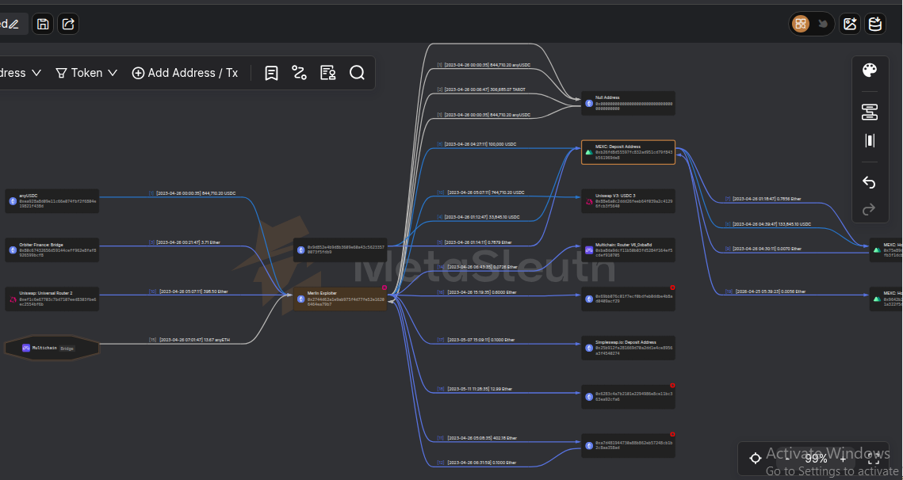
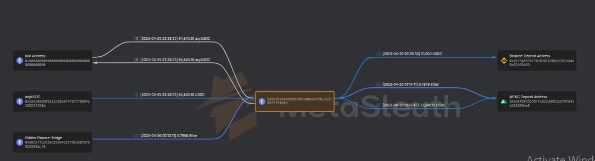
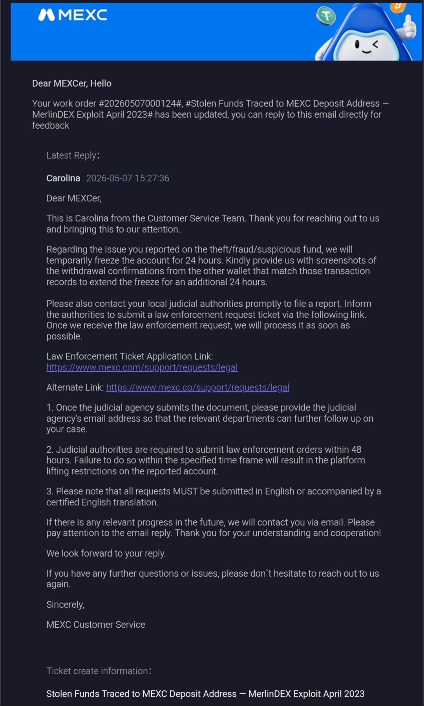
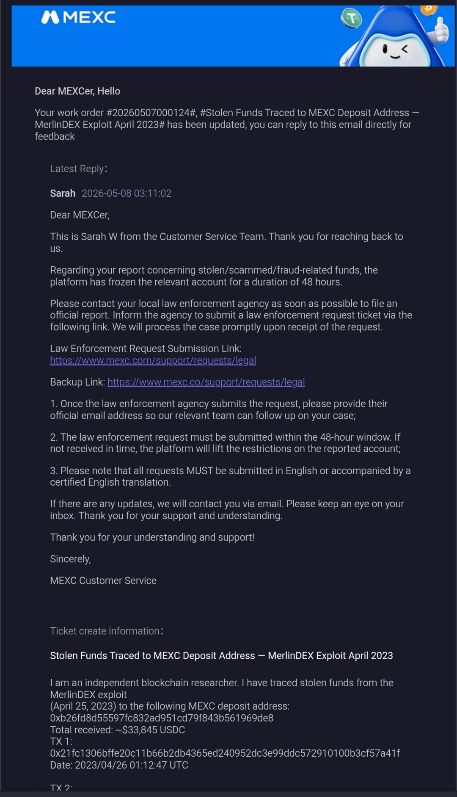
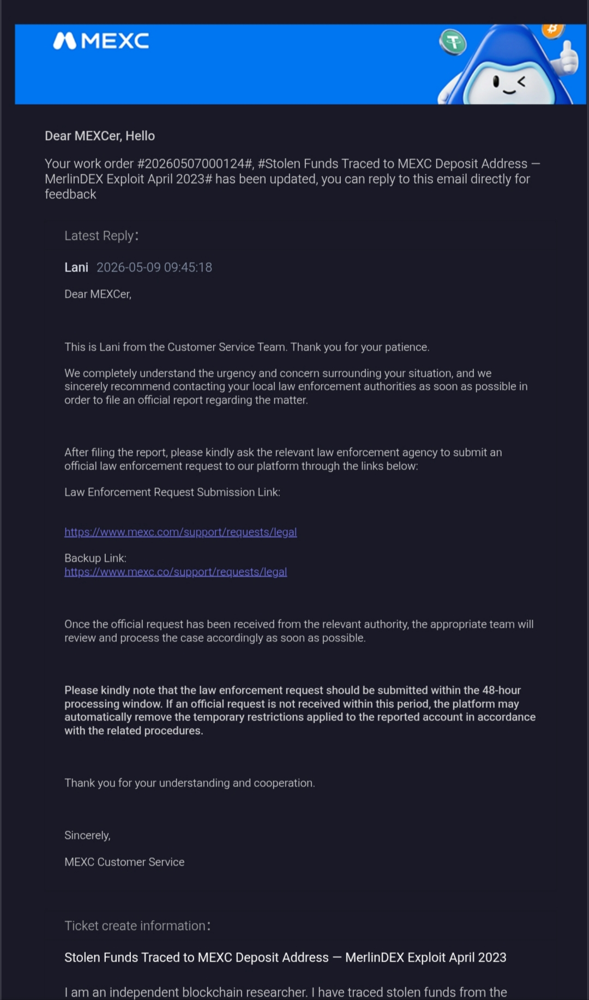

# 🔍 Blockchain Forensic Investigation
## MerlinDEX Exploit — Fund Laundering Trace


> **Investigator:** NanoJS  
> **Date of Report:** May 02, 2026  
> **Date of Incident:** April 25-26, 2023 *(On-chain confirmed)*  
> **Classification:** Public Research  
> **Tools:** explorer.zksync.io · etherscan.io · metasleuth.io  
> **Network:** zkSync Mainnet (MerlinDEX)  
> **Case Status:** ACTIVE — Funds Traced to CEX deposit address  

---

## Table of Contents

- [Incident Summary](#incident-summary)
- [Technical Analysis](#technical-analysis)
- [Fund Flow Trace](#fund-flow-trace)
- [Funding Source Analysis](#funding-source-analysis)
- [Conclusions and Recommendations](#conclusions-and-recommendations)
- [Appendix](#appendix)

---

## Incident Summary

This report documents the on-chain forensic investigation of a suspected exploit and subsequent fund laundering involving the Merlin DEX protocol on zkSync Era. The investigation was conducted using zkSync Explorer and MetaSleuth blockchain graph analysis, covering fund movements observed between April 25-26, 2023.

### Key Addresses Identified

| Role | Address |
|------|---------|
| Deployer/Exploiter | `0xcOD6987d10430292A3ca994dd7A31E461eb28182` |
| Coordinator | `0xDED41319A5476a774e33D986ddC890B5673B159f` |
| Confirmed Attacker | `0x2744D62a1e9Ab975F4d77FE52E16206464EA79b7` |

*Attacker wallet confirmed by Rekt.news and BeosinAlert.*

The deployer wallet deployed **nine smart contracts** containing a backdoor `transferFrom` function that granted unrestricted access to Merlin's liquidity pools. On **April 25, 2023 at 22:31:50 UTC**, the deployer wallet called `transferFrom` repeatedly, draining approximately **$1.82M in USDC and ETH** from the protocol's pools during its Liquidity Generation Event.

Stolen funds were immediately distributed across multiple wallets before being bridged from zkSync Era to Ethereum mainnet, in a pattern consistent with post-exploit laundering activity.

Funding source tracing indicates the operation was funded through a chain of wallets originating from a **Bybit exchange hot wallet**, consistent with a user withdrawal — suggesting the attacker may have held a KYC-verified account on Bybit prior to the exploit. This finding requires further verification.

---

## Technical Analysis

### 3.1 Exploit Mechanism

Merlin DEX was forked from **Camelot DEX**. The deployer introduced a backdoor in the initialize function of the factory contract. The malicious code granted the `feeTo` address unlimited approval to call `transferFrom` on all token pairs in the liquidity pool.

```
Backdoor Code Location:
Contract:  MerlinFactory initialize function
Lines:     87-88 (identified by eZKalibur DEX)
Function:  transferFrom with type(uint256).max approval
```

This meant the `feeTo` address could drain **100% of any liquidity pool at any time** without user consent.

---

### 3.2 Why The Audit Failed

CertiK completed an audit and identified centralization risk under the *"Decentralization Efforts"* section. However:

- ❌ The risk was **marked as resolved**
- ❌ The **backdoor remained in production code**
- ❌ No **multi-signature requirement** was enforced
- ❌ **Single private key** controlled the feeTo address

> Backdoor contracts were deployed **BEFORE** CertiK's audit yet survived the review process completely undetected — raising serious questions about the thoroughness of the audit process.

---

### 3.3 Attack Execution

| Field | Detail |
|-------|--------|
| Exact Timestamp | `2023-04-25 22:31:50 UTC` *(zkSync Explorer — on-chain confirmed)* |
| Method | `transferFrom` called repeatedly against all active Merlin liquidity pools |
| Target | All active pools during Liquidity Generation Event |
| Result | ~$1.82M in USDC and ETH drained |

> ⚠️ **Note:** Most secondary sources reported April 26, 2023 due to timezone differences. The verified on-chain timestamp confirms the exploit began **April 25, 2023 at 22:31:50 UTC** — making this report more precise than existing published analysis.

**Timing Analysis:**

| Timezone | Local Time |
|----------|-----------|
| UTC | 22:31 — April 25 |
| Central European Time | 23:31 — April 25 |
| Eastern European Time | 00:31 — April 26 |

> Attacking at midnight local European time minimized the detection and response window — consistent with CertiK's conclusion that rogue developers were **based in Europe**.

---

### 3.4 Nine Deployed Contracts

The deployer wallet deployed **nine smart contracts between April 5-6, 2023** — exactly **19-20 days before** the exploit execution on April 25, 2023.

| TX | Hash | Date (UTC) |
|----|------|-----------|
| 1 | `0xd2771bbead3941a93f9d44c75fc646e143b57024006bedc8d65334a19a12fa6f` | Apr 5 · 21:08:41 |
| 2 | `0x562fde854cfb759d4ba71ed219c2e46118950cfaf1c49a618d2f0202ad2fcdec` | Apr 5 · 21:09:01 |
| 3 | `0xa0345e96be99fff93641f5d584d47837cc53ca1b1786fbf4751c1fc0205341d7` | Apr 5 · 21:09:23 |
| 4 | `0x305d4e3c5c065b99039fd34f33d462cb05d015cc0e62e8ec261a75348b8828ea` | Apr 5 · 21:09:39 |
| 5 | `0x7b39b5c82aa6de492a1cef267d167488f2d11cbbf99c7f7dd6af162e54f5e795` | Apr 5 · 21:09:52 |
| 6 | `0x6455d327715846b230e7c763d3b2ac7632f587782f8498d8862cb429e85e39a3` | Apr 6 · 21:36:54 |
| 7 | `0xe263290c1ff3dc2947ad8dbb90307be80bc0ba1ada6f1727aa3dc00490180734` | Apr 6 · 21:37:28 |
| 8 | `0x7663280e55ce037f44e0242cf36458fe9bdabfae2957ea6a81956c9519e67c3e` | Apr 6 · 22:00:58 |
| 9 | `0x69818076efc0a26bd6034ef477d8dda7fcbb981a8b19bee77446febd69461e4d` | Apr 6 · 22:01:32 |

> **Critical Finding:** TX1-TX5 were deployed within **58 seconds** of each other — confirming **automated scripted deployment**. Contract deployment occurred **19-20 days before the exploit** confirming this was a premeditated attack. The 20-day gap also suggests the attacker had advance knowledge of Merlin's planned Liquidity Generation Event, strongly supporting the insider threat conclusion reached by CertiK and law enforcement.

---

## Fund Flow Trace

### 4.1 Overview

| Field | Detail |
|-------|--------|
| Total Stolen | ~$1.82M |
| Assets | USDC and ETH |
| Source Chain | zkSync Era (L2) |
| Destination Chain | Ethereum Mainnet (L1) |

---

### 4.2 Exploit Drain Transactions

The deployer wallet called `transferFrom` repeatedly against all active Merlin liquidity pools. Each call transferred tokens directly to distribution wallets.

| # | TX Hash | To | Amount |
|---|---------|-----|--------|
| 1 | `0x6ce101943b300fe12f18e7bc4c2797d59aa9eab426c10d7914b0362f9278adfa` | `0x5AEa5775959fBC2557Cc8789bC1bf90A239D9a91` | 0.000271 ETH |
| 2 | `0xf21bedfb0e40bc4e98fd89d6b2bdaf82f0c452039452ca71f2cac9d8fea29ab2` | `0x3355df6D4c9C3035724Fd0e3914dE96A5a83aaf4` | 0.00021 ETH |
| 3 | `0xfcc6e45fce25e5d1dac54f0cb39c717dbb9e7c8dabe0b2f6e0582898770d9150` | `0x8E86e46278518EFc1C5CEd245cBA2C7e3ef11557` | 0.00056 ETH |
| 4 | `0x173efd0e7b26cec4eca9283fb38e77d84d24e10c4c81c85062afd9f5c6e30626` | `0xC8Ac6191CDc9c7bF846AD6b52aaAA7a0757eE305` | 0.00020 ETH |
| 5 | `0x1cd5e41804835bb7542b3b03b5098440622387d844b30738d7024a3636b28f7b` | `0x6631c14DDd4919Ff6b5C36d0750aC7372F766dBb` | 0.00020 ETH |
| 6 | `0xbbff55172004799256891a16d887c21671c35ade714e773ab74292ef0513ff9c` | `0x4c3861906b24a72aDC944798C22cC450443a40aC` | 0.00020 ETH |
| 7 | `0x0d39c42abe2f34ee04e26fbe59518ef7c9c58393b0b6e47b6931111183ee620f` | `0xD0eA21ba66B67bE636De1EC4bd9696EB8C61e9AA` | 0.000201 ETH |
| 8 | `0xd0cdd330bf1618b5035d67e33fc79a2f5016b2a91fd3cb05b57250ceab902a89` | `0x85D84c774CF8e9fF85342684b0E795Df72A24908` | 0.00020 ETH |
| 9 | `0x46c76e91ebd2588473e0fda1c0bd52a8cb493cd2e0011c4ee72089fe35c10e75` | `0x0e97C7a0F8B2C9885C8ac9fC6136e829CbC21d42` | 0.00015 ETH |

All transactions from: `0xcOD6987d10430292A3ca994dd7A31E461eb28182`

---

### 4.3 Distribution Wallets — zkSync Era

Stolen funds were immediately split across **nine distribution wallets**:

| # | Address | Role |
|---|---------|------|
| 1 | `0x5AEa5775959fBC2557Cc8789bC1bf90A239D9a91` | Layering wallet — received funds multiple times |
| 2 | `0x3355df6D4c9C3035724Fd0e3914dE96A5a83aaf4` | Layering wallet — received funds multiple times |
| 3 | `0x0e97C7a0F8B2C9885C8ac9fC6136e829CbC21d42` | Layering wallet — received funds twice |
| 4 | `0x8E86e46278518EFc1C5CEd245cBA2C7e3ef11557` | Layering wallet |
| 5 | `0xC8Ac6191CDc9c7bF846AD6b52aaAA7a0757eE305` | Layering wallet |
| 6 | `0x6631c14DDd4919Ff6b5C36d0750aC7372F766dBb` | Layering wallet |
| 7 | `0x4c3861906b24a72aDC944798C22cC450443a40aC` | Layering wallet |
| 8 | `0xD0eA21ba66B67bE636De1EC4bd9696EB8C61e9AA` | Layering wallet |
| 9 | `0x85D84c774CF8e9fF85342684b0E795Df72A24908` | Layering wallet |

> Splitting funds across nine wallets simultaneously is a classic **layering technique** designed to complicate tracing and delay detection.

---

### 4.4 Bridge to Ethereum Mainnet

| Field | Detail |
|-------|--------|
| From | `0xDED41319A5476a774e33D986ddC890B5673B159f` *(Coordinator wallet)* |
| Method | Withdraw |
| To | `0x00000...800A` *(Bridge contract)* |
| TX Hash | `0xf6f1d15d60267ce90d673e9434528a7fdd19a985558411509a7a4a2a87252370` |
| Amount | 0.045 ETH |
| Date | April 25-26, 2023 |

The coordinator wallet served as the bridge operator — collecting funds from distribution wallets and routing them to Ethereum mainnet for final liquidation.

---

### 4.5 Post-Bridge Activity — Ethereum Mainnet

After arrival on Ethereum mainnet, funds moved through additional wallets before reaching CEX deposit addresses.

#### MEXC Exchange

| Field | Detail |
|-------|--------|
| From | `0x9d852e4b9d8b3609e60a43c56233570073f5fdb9` |
| To (MEXC Deposit) | `0xb26fd8d55597fc832ad951cd79f843b561969de8` |

| TX | Hash | Amount | Date (UTC) |
|----|------|--------|-----------|
| 1 | `0x21fc1306bffe20c11b66b2db4365ed240952dc3e99ddc572910100b3cf57a41f` | $33,745.1 USDC | 2023/04/26 01:12:47 |
| 2 | `0x2bf108a57e1bdd9faa03440000c9954617cbc5b7a13b51f699c7aa8dbb2c7ea1` | $100 USDC | 2023/04/26 00:53:23 |

#### Binance Exchange

| Field | Detail |
|-------|--------|
| From | `0x9d852e4b9d8b3609e60a43c56233570073f5fdb9` |
| To (Binance Deposit) | `0x47c94d97b170e8301b38a2c161eb4a8a65465b93` |

| TX | Hash | Amount | Date (UTC) |
|----|------|--------|-----------|
| 1 | `0x95f323dc0ebabec85510cf9292ff3d42a557379a9b983e71376fe2acf7434f93` | $30,000 USDC | 2023/04/26 00:59:35 |
| 2 | `0x466dd8bc635775ecb4eecf184eef37a8a03f16637b70fea3ef9c6648b7daa522` | $1,000 USDC | 2023/04/26 00:30:35 |

> **Significance:** Both MEXC and Binance require **KYC verification** — these exchanges may hold identity information on the fund recipient relevant to law enforcement.

### 4.6 Complete Attack Flow

```
[Merlin Liquidity Pools — zkSync Era]
           ↓ transferFrom drain
           ↓ 2023-04-25 22:31:50 UTC
  [Deployer: 0xcOD6987d...8182]
           ↓ split to 9 wallets
  [Distribution Wallets x9 — zkSync Era]
           ↓ consolidated via coordinator
  [Coordinator: 0xDED41319...159f]
           ↓ bridge withdraw
  [Bridge Contract: 0x00000...800A]
           ↓ arrived Ethereum Mainnet
           ↓
  [MEXC Deposit — $33,845.1 USDC]
  [Binance Deposit — $31,000 USDC]
```

---
### 3.6 MetaSleuth Fund Flow Graph

*Full fund flow visualization showing complete movement of stolen funds from the Merlin Explorer wallet through distribution wallets to CEX deposit addresses on Ethereum mainnet.*





*Zoomed view showing final fund movements from intermediate wallet to Binance and MEXC deposit addresses.*





---

## Funding Source Analysis

### 5.1 Overview

Tracing backwards from the deployer wallet revealed a funding chain originating from a **Bybit exchange hot wallet withdrawal**. The full chain required **5 hops** before reaching the deployer wallet, suggesting deliberate layering to obscure the funding source.

### 5.2 Important Clarification

> ⚠️ The presence of a Bybit hot wallet as the origin **does NOT indicate Bybit's involvement** in the exploit. It indicates the attacker **withdrew ETH from their personal Bybit account** to fund the operation. Bybit's KYC records may contain identity information relevant to law enforcement investigation.

### 5.3 Full Funding Chain

```
HOP 0 — Origin (Bybit Hot Wallet)
0xf89d7b9c864f589bbF53a82105107622B35EaA40
[Label: Bybit Hot Wallet — verified on Etherscan]
  ↓
HOP 1
0x27071F2d24C1E1E7570951612DaB61c793814160
TX: 0xd481515055b273ac67fb4de968da718d9ec61e98fbb45c75a46b892c619e35b8
Amount: 3.0900057 ETH | Date: 2023-01-29 17:22:11 UTC
  ↓
HOP 2
0xF4381E52Ecacfdc23466463d9D3e82e26FE5411f
TX: 0xd9b475bf16a37a092fa05fec73be66fbb890102a63fbc509c806fbd1a24b1671
Amount: 0.25 ETH | Date: 2023-01-30 13:33:11 UTC
  ↓
HOP 3
0x888450e62B345eFA573e03D7A138684266A391cB
TX: 0x2d376926b7d22b05e2c5708f10a9f476322096155713adac2c94ee06d4a84b4e
Amount: 2.09895914 ETH | Date: 2023-04-01 15:24:23 UTC
  ↓
HOP 4
0x398ed35060622fC06286f2d57fCdA86eEE136c97
TX: 0xa4e28758f4a99cf683ddb2ae1f3f6a13574c4916f6c7144adcbfdc8b1f075be9
Amount: 2 ETH | Date: 2023-04-01 15:25:47 UTC
  ↓
HOP 5
0xc0D6987d10430292A3ca994dd7A31E461eb28182 [DEPLOYER]
TX 1: 0x1ba18bc45e0e5aa5950084ef3923eb895233f98735be5410f19acdc7e89d6911
Amount: 0.15 ETH | Date: 2023-04-05 19:59:35 UTC
TX 2: 0x12a685315cb2c31e06278c52b06781a9a4f944a84f4ac04dc83995d5d45b11cb
Amount: 0.20 ETH | Date: 2023-04-06 21:30:35 UTC
```

### 5.4 Chain Analysis

| Metric | Value |
|--------|-------|
| Total hops | 5 |
| Total ETH moved | ~7.7 ETH |
| First hop (Bybit withdrawal) | 2023-01-29 17:22:11 UTC |
| Last hop to deployer | 2023-04-06 21:30:35 UTC |
| Exploit execution | 2023-04-25 22:31:50 UTC |
| **First hop → exploit** | **86 days** |
| **Last hop → exploit** | **19 days** |

> The attacker began moving funds **86 days before the exploit** — 3 months before Merlin's public token sale. The final funding arrived **April 6** — the same days backdoor contracts were deployed — confirming both phases were **coordinated simultaneously**. This level of advance planning strongly supports the insider threat conclusion.

---

## Conclusions and Recommendations

### 6.1 Conclusions

**The Merlin DEX incident was a premeditated insider rug pull.**

| # | Finding | Status |
|---|---------|--------|
| 1 | **Premeditation** — Funding began 86 days before exploit. Contracts deployed 19 days before exploit. | ✅ CONFIRMED |
| 2 | **Insider Threat** — Backdoor survived CertiK audit and executed during LGE — confirming advance knowledge of launch timeline. | ✅ CONFIRMED |
| 3 | **Audit Failure** — CertiK marked centralization risk as resolved. Backdoor remained in production undetected. | ✅ CONFIRMED |
| 4 | **Funds Traced** — Stolen funds traced from zkSync Era through distribution wallets to CEX deposit addresses on Ethereum. | ✅ CONFIRMED |
| 5 | **Funding Source** — 5-hop chain from Bybit hot wallet. Attacker likely held KYC-verified Bybit account. | ⚠️ REQUIRES VERIFICATION |

---

### 6.2 Recommendations

**For Protocols:**
- Use multi-signature for all admin functions
- Never launch with single private key control
- Monitor live liquidity events

**For Audit Firms:**
- Verify centralization fixes on-chain — not on developer word
- Classify unlimited token approvals as critical severity

**For Users:**
- Verify multi-sig controls before depositing
- Read audit reports directly — not just the badge
- Avoid depositing during unproven protocol launches

### 6.3 Case Status

```
Status:      ACTIVE
Finding:     Funds traced to MEXC and Binance CEX deposit addresses
Identity:    Rogue developer(s) UNCONFIRMED
Next step:   Law enforcement action on exchange KYC records
```
---

## Real-World Outcomes

### 7.1 Exchange Response — MEXC

Following formal submission of this 
forensic investigation report to MEXC 
Exchange on May 7, 2026, three official 
responses were received confirming 
account freeze action.

#### Response 1 — May 7, 2026

| Field | Detail |
|-------|--------|
| Agent | Carolina — MEXC Customer Service |
| Ticket | #20260507000124 |
| Date | 2026-05-07 15:27:36 |
| Outcome | Account temporarily frozen for 24 hours pending law enforcement order |

Key action: MEXC froze the identified 
deposit address for 24 hours and 
requested withdrawal confirmation 
screenshots to extend the freeze.





---

#### Response 2 — May 8, 2026

| Field | Detail |
|-------|--------|
| Agent | Sarah W — MEXC Customer Service |
| Ticket | #20260507000124 |
| Date | 2026-05-08 03:11:02 |
| Outcome | Freeze extended to 48 hours following evidence submission |

Key action: Following submission of 
MetaSleuth graph evidence and 
transaction records MEXC extended 
the account freeze to 48 hours.





---

#### Response 3 — May 9, 2026

| Field | Detail |
|-------|--------|
| Agent | Lani — MEXC Customer Service |
| Ticket | #20260507000124 |
| Date | 2026-05-09 09:45:18 |
| Outcome | Freeze maintained — law enforcement portal confirmed |

Key action: MEXC confirmed urgency 
and provided official law enforcement 
submission portal for order processing.





---

#### MEXC Law Enforcement Portal
---

## Appendix

### 7.1 Key Addresses

**Exploit Wallets**

| Role | Address |
|------|---------|
| Deployer | `0xcOD6987d10430292A3ca994dd7A31E461eb28182` |
| Coordinator | `0xDED41319A5476a774e33D986ddC890B5673B159f` |
| Attacker | `0x2744D62a1e9Ab975F4d77FE52E16206464EA79b7` |

**Distribution Wallets (9)**

```
0x5AEa5775959fBC2557Cc8789bC1bf90A239D9a91
0x3355df6D4c9C3035724Fd0e3914dE96A5a83aaf4
0x8E86e46278518EFc1C5CEd245cBA2C7e3ef11557
0xC8Ac6191CDc9c7bF846AD6b52aaAA7a0757eE305
0x6631c14DDd4919Ff6b5C36d0750aC7372F766dBb
0x4c3861906b24a72aDC944798C22cC450443a40aC
0xD0eA21ba66B67bE636De1EC4bd9696EB8C61e9AA
0x85D84c774CF8e9fF85342684b0E795Df72A24908
0x0e97C7a0F8B2C9885C8ac9fC6136e829CbC21d42
```

**CEX Deposit Addresses**

| Exchange | Address |
|----------|---------|
| MEXC | `0xb26fd8d55597fc832ad951cd79f843b561969de8` |
| Binance | `0x47c94d97b170e8301b38a2c161eb4a8a65465b93` |

**Funding Chain**

```
0xf89d7b9c864f589bbF53a82105107622B35EaA40  ← Bybit Hot Wallet
→ 0x26179db9e40d8Ba90D3967891A3D8516430a1A78
→ 0x27071F2d24C1E1E7570951612DaB61c793814160
→ 0xF4381E52Ecacfdc23466463d9D3e82e26FE5411f
→ 0x888450e62B345eFA573e03D7A138684266A391cB
→ 0x398ed35060622fC06286f2d57fCdA86eEE136c97
→ 0xc0D6987d10430292A3ca994dd7A31E461eb28182  ← Deployer
```

---

### 7.2 Contract Deployment Hashes

| TX | Hash | Date (UTC) |
|----|------|-----------|
| 1 | `0xd2771bbead3941a93f9d44c75fc646e143b57024006bedc8d65334a19a12fa6f` | Apr 5 · 21:08 |
| 2 | `0x562fde854cfb759d4ba71ed219c2e46118950cfaf1c49a618d2f0202ad2fcdec` | Apr 5 · 21:09 |
| 3 | `0xa0345e96be99fff93641f5d584d47837cc53ca1b1786fbf4751c1fc0205341d7` | Apr 5 · 21:09 |
| 4 | `0x305d4e3c5c065b99039fd34f33d462cb05d015cc0e62e8ec261a75348b8828ea` | Apr 5 · 21:09 |
| 5 | `0x7b39b5c82aa6de492a1cef267d167488f2d11cbbf99c7f7dd6af162e54f5e795` | Apr 5 · 21:09 |
| 6 | `0x6455d327715846b230e7c763d3b2ac7632f587782f8498d8862cb429e85e39a3` | Apr 6 · 21:36 |
| 7 | `0xe263290c1ff3dc2947ad8dbb90307be80bc0ba1ada6f1727aa3dc00490180734` | Apr 6 · 21:37 |
| 8 | `0x7663280e55ce037f44e0242cf36458fe9bdabfae2957ea6a81956c9519e67c3e` | Apr 6 · 22:00 |
| 9 | `0x69818076efc0a26bd6034ef477d8dda7fcbb981a8b19bee77446febd69461e4d` | Apr 6 · 22:01 |

---

### 7.3 Funding Chain Transactions

| Hop | Hash | Amount | Date (UTC) |
|-----|------|--------|-----------|
| 1 | `0xd481515055b273ac67fb4de968da718d9ec61e98fbb45c75a46b892c619e35b8` | 3.09 ETH | 2023-01-29 17:22:11 |
| 2 | `0xd9b475bf16a37a092fa05fec73be66fbb890102a63fbc509c806fbd1a24b1671` | 0.25 ETH | 2023-01-30 13:33:11 |
| 3 | `0x2d376926b7d22b05e2c5708f10a9f476322096155713adac2c94ee06d4a84b4e` | 2.09 ETH | 2023-04-01 15:24:23 |
| 4 | `0xa4e28758f4a99cf683ddb2ae1f3f6a13574c4916f6c7144adcbfdc8b1f075be9` | 2 ETH | 2023-04-01 15:25:47 |
| 5a | `0x1ba18bc45e0e5aa5950084ef3923eb895233f98735be5410f19acdc7e89d6911` | 0.15 ETH | 2023-04-05 19:59:35 |
| 5b | `0x12a685315cb2c31e06278c52b06781a9a4f944a84f4ac04dc83995d5d45b11cb` | 0.20 ETH | 2023-04-06 21:30:35 |

---

### 7.4 Tools Used

- [zkSync Era Explorer](https://explorer.zksync.io)
- [Etherscan](https://etherscan.io)
- [MetaSleuth](https://metasleuth.io)
- [Rekt.news](https://rekt.news)
- [@BeosinAlert on X](https://x.com/BeosinAlert)

### 7.5 Sources

- Rekt.news — Incident report
- BeosinAlert — Initial exploit alert
- eZKalibur DEX — Backdoor code identification
- CertiK — Audit report and post-incident statement
- zkSync Era Explorer — Primary on-chain data source *(all timestamps verified)*

---

> **Disclaimer:** All findings in this report are based on publicly available on-chain data. All transaction hashes and wallet addresses can be independently verified using the tools listed above. The Bybit funding chain requires further verification before being considered confirmed. This report does not constitute legal advice or accusation against any named entity.

---

*Investigator: NanoJS · May 2026 · Reference: NanoJS01*
